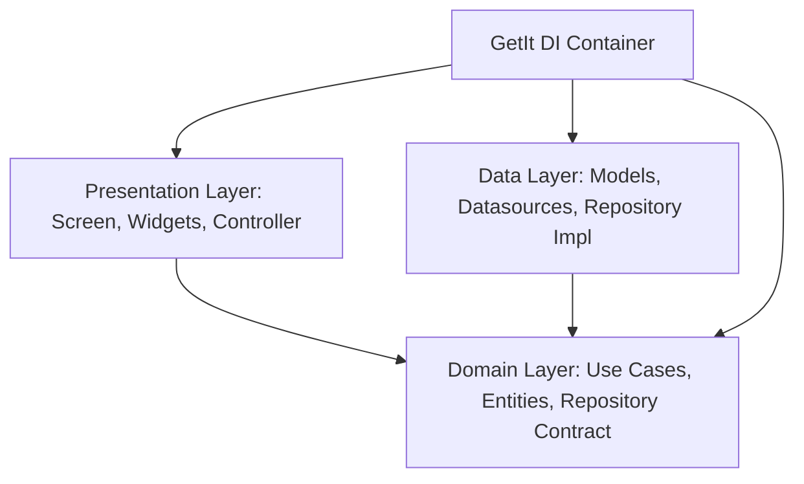

# Enterprise-Grade Flutter Expense Tracker

A production-ready, feature-first Clean Architecture Expense Tracker application utilizing GetIt for Dependency Injection, GoRouter for navigation, manual Flavors for environment segregation, Isar local database abstractions, custom logger, unified theme systems, and comprehensive unit/widget test coverage.

---

## 1. Architecture Overview

This project is built using **Feature-First Clean Architecture**. This structure isolates the core business logic from database layers and user interfaces, ensuring that the app remains modular, scalable, and easy to maintain.



### Clean Architecture Layers

1. **Domain Layer (Pure Dart)**
   - **Entities**: Business logic objects containing core models (`ExpenseEntity`).
   - **Repository Contracts**: Abstract interfaces defining repository methods.
   - **Use Cases**: Individual execution units encapsulating a single business rule (e.g. `AddExpense`, `GetMonthlySummary`).

2. **Data Layer**
   - **Models**: Database-specific schemas mapped to domain entities (`ExpenseModel`).
   - **Datasources**: Local database adapters executing queries (`IsarExpenseLocalDatasourceImpl`).
   - **Repository Implementation**: Implements repository contracts, managing conversion between models and entities.

3. **Presentation Layer**
   - **Controllers**: Extends `ChangeNotifier` to manage widget states using domain use cases.
   - **Widgets**: Reusable visual components styled with theme systems (`ExpenseBarGraph`, `ExpenseTile`).
   - **Screens**: Complete page layouts responding to controller states (`HomeScreen`).

4. **App Layer & Core**
   - **di**: Service locator configuration via `GetIt`.
   - **routes**: Modular application navigation utilizing `GoRouter`.
   - **core/themes**: Light and dark styling systems, centralized palette (`AppColors`), spacing (`AppSpacing`), and typography.
   - **core/logging**: Custom structured logger wrapper.

---

## 2. Directory Structure

```text
lib/
├── app/
│   ├── di/                 # Dependency injection container (GetIt)
│   ├── routes/             # App routing (GoRouter)
│   └── app.dart            # Root MaterialApp
│
├── core/
│   ├── constants/          # Environment configuration (AppConfig)
│   ├── error/              # Failure and Exception definitions
│   ├── logging/            # Custom logging service (LoggerService)
│   ├── themes/             # Material 3 Light/Dark Theme definitions
│   ├── utils/              # Parsers, date formatters, validators
│   └── widgets/            # Generic reusable widgets
│
├── features/
│   └── expenses/
│       ├── data/           # Models, local datasources, repository impls
│       ├── domain/         # Entities, repositories interfaces, use cases
│       └── presentation/   # State controllers, screens, widgets
│
├── main_dev.dart           # Development Entrypoint
├── main_staging.dart       # Staging Entrypoint
├── main_prod.dart          # Production Entrypoint
└── main.dart               # Default forwarding main
```

---

## 3. Environment Flavors

The project manually configures environments through separate entrypoints to isolate database storage and assets:

- **Development (`main_dev.dart`)**: Loads database `expense_tracker_dev` and shows debug banners.
- **Staging (`main_staging.dart`)**: Loads database `expense_tracker_stg`.
- **Production (`main_prod.dart`)**: Loads database `expense_tracker_prod` with absolute optimizations.

### Running with Flavors
```bash
# Run Development Mode
flutter run -t lib/main_dev.dart

# Run Staging Mode
flutter run -t lib/main_staging.dart

# Run Production Mode
flutter run -t lib/main_prod.dart
```

---

## 4. Local Database Code Generation

Whenever database models in `lib/features/expenses/data/models/expense_model.dart` are modified, run `build_runner` to update Isar adapters:

```bash
dart run build_runner build --delete-conflicting-outputs
```

---

## 5. Testing & Verification

Comprehensive test suites isolate calculations, repository mappings, controller mutations, and visual render elements:

### Test Coverage
- **Unit Tests**:
  - `get_monthly_summary_test.dart`: Validates rolling 12-month summary arrays.
  - `expense_repository_impl_test.dart`: Tests data mapping and mock datasource conversions.
  - `expense_controller_test.dart`: Tests state transitions and async loading flags.
- **Widget Tests**:
  - `widget_test.dart`: Mocks controller state and asserts correct rendering on `HomeScreen`.

### Executing Tests
```bash
# Run Lint/Static Analysis
flutter analyze

# Run Automated Test Suite
flutter test
```

---

## 6. CI/CD Integration

We have integrated a **GitHub Actions CI Pipeline** in `.github/workflows/flutter_ci.yml`. On every pull request and push to `main`/`develop`, it automatically runs:
1. Flutter dependencies fetch.
2. Code generation (`build_runner`).
3. Static analyzer validations.
4. Complete automated test suite check.
